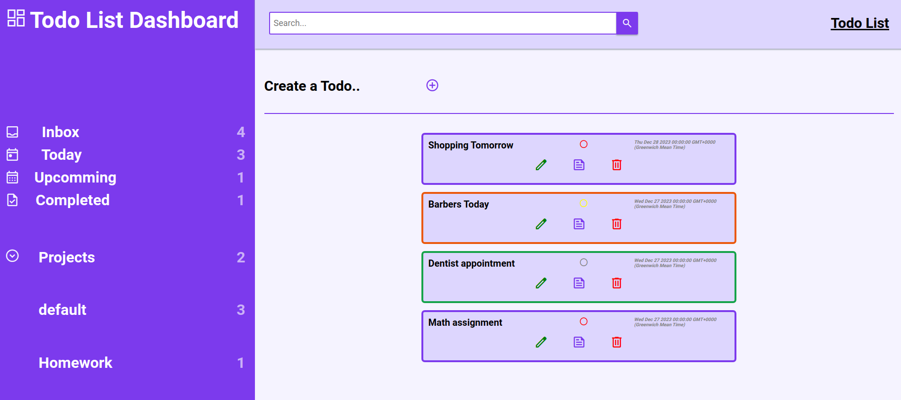

# Todo-List
Live demo &#128073; https://masecurity.github.io/Todo-List/
## What is this project about?
This project is about creating a Todo-list , that allows users to create reminders for what they intend to do,
a Todo is comprised of a title, description, duedate, priority, status such as completed, in progress, not in progress, and finally the option to include a project.
This project is useful in showing which Todos are due today or upcomming, or even Todos that have  already been completed. all Todos are kept in the inbox,
and are assigned a default project, in the case that user's dont assign it themselves. Users also have the abillity to update, read or remove their Todos.
 

 

## What i learned
- Webpack merge
- localStorage
- DOM Manipulation
- ES6 Modules
- Object Oriented Programming
- Source maps
- NPM

## Dependencies
Quick tip: Dependencies can be installed from the package.json file by running npm install.